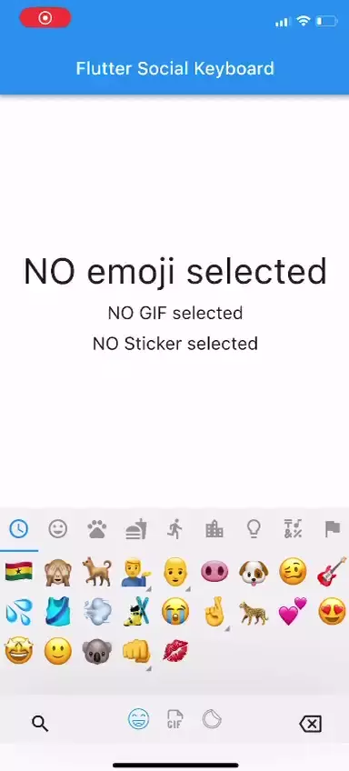
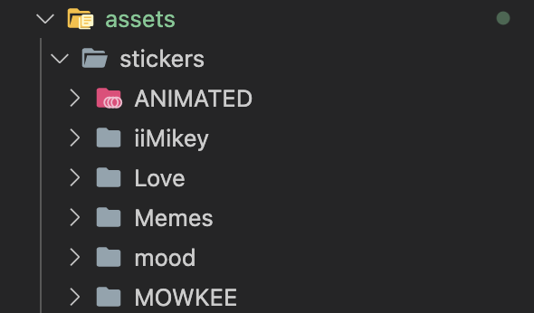
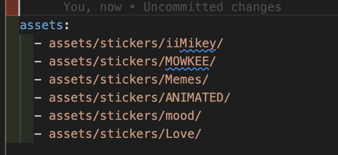
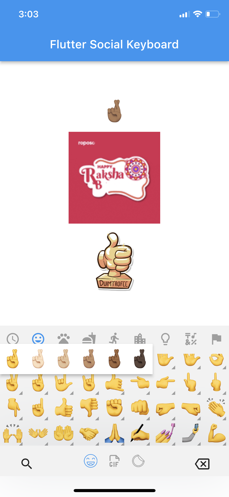
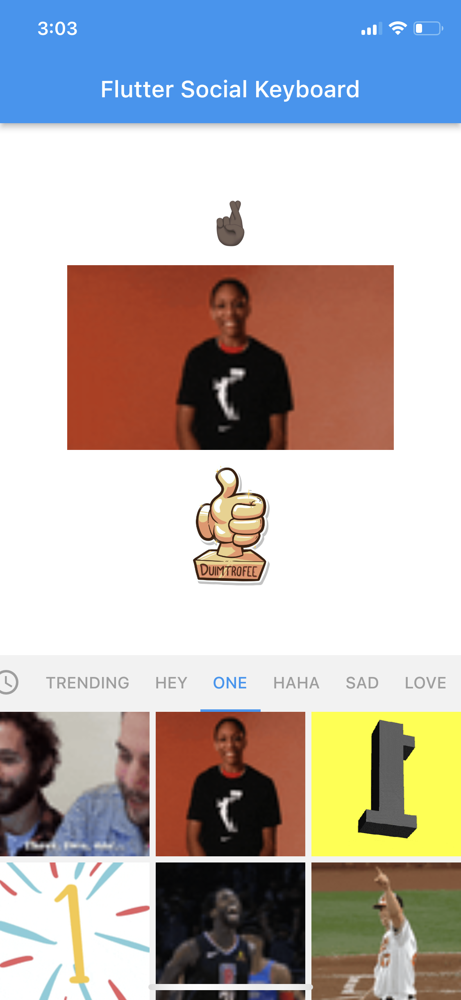
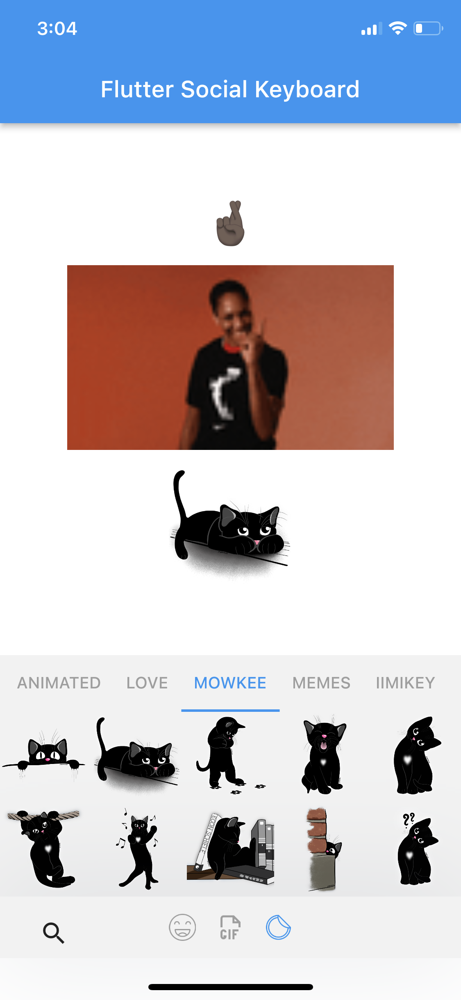

# flutter_social_keyboard

Fully customizable Emoji picker, Gif picker and Sticker for your flutter social media and chat applications

  > **Acknowledgment:** Much thanks to [Stefan Humm](https://github.com/Fintasys) for [emoji_picker_flutter](https://pub.dev/packages/emoji_picker_flutter).

## Preview



## Support
If the package was useful or saved your time, please do not hesitate to buy me a cup of coffee! ;)  
The more caffeine I get, the more useful projects I can make in the future. 

<a href="https://www.buymeacoffee.com/saytoonz" target="_blank"></a>


## Key features
- Access to Emoji, Gif and Sticker picker
- Giphy gifs
- Developer determined Stickers
- Lightweight Package
- Faster Loading
- Null-safety
- Material Design and Cupertino mode
- Emojis that cannot be displayed are filtered out (Android Only)
- Optional recently used tabs
- Skin Tone Support for emojis
- Completely customizable


## Getting Started

## Installation

Add Get to your pubspec.yaml file:

```yaml
dependencies:
  flutter_social_keyboard: <version>
```

Import get in files that it will be used:

```dart
import 'package:flutter_social_keyboard/flutter_social_keyboard.dart';
```
<br>

### Emoji setup
- Do nothing

### Gif setup
Package depends on [GIPHY GIF](https://giphy.com/)
- Sign up as [giphy developer](https://developers.giphy.com/dashboard) to optain API Key
- Giphy API Key is **required** to use the gif picker in this package


### Sticker setup
Package depends on your project asset for sticker images
- Create an **asset** folder in your project directory (name must be *asset*)
- Create a folder named **stickers** within the asset folder
- Create sub-folders in the sticker containing an the sticker asset files
<br>

<br>
- Folder names of the sub-folders in the sticker folders are considered as categories and tab names
- Supported files include .png, .gif, .webp, .jpg and .jpeg,
- Link all sticker folders in the pubspec.yaml file
<br>

<br>


## Usage

```dart
FlutterSocialKeyboard(
  onEmojiSelected: (Category category, Emoji emoji) {
    // Do something when emoji is tapped (optional)
    // print(emoji);
    setState(() {
      selectedEmoji = emoji;
    });
  },
  onGifSelected: (GiphyGif gif) {
    // Do something when gif is tapped (optional)
    // print(gif);
  },
  onStickerSelected: (Sticker sticker) {
    // Do something when sticker is tapped (optional)
    // print(sticker.toJson());
  },
  onBackspacePressed: () {
    // Do something when the user taps the backspace button (optional)
    // print("Backspace button pressed");
  },
  keyboardConfig: KeyboardConfig(
    useEmoji: true, //Enable emoji picker
    useGif: true, //Enable gif picker
    useSticker: true, //Enable Sticker picker

    giphyAPIKey: "API KEY HERE", 
    gifTabs: ["Hey", "One", 'Haha', 'Sad', 'Love', 'Reaction'],
    gifHorizontalSpacing: 5,
    gifVerticalSpacing: 5,
    gifColumns: 3,
    gifLang: GiphyLanguage.english,
    //
    stickerColumns: 5,
    stickerHorizontalSpacing: 5,
    stickerVerticalSpacing: 5,
    //
    withSafeArea: true,
    //
    emojiColumns: 9,
    emojiSizeMax: 32 * (Platform.isIOS ? 1.30 : 1.0),
    emojiVerticalSpacing: 0,
    emojiHorizontalSpacing: 0,
    gridPadding: EdgeInsets.zero,
    initCategory: Category.RECENT,
    bgColor: const Color(0xFFF2F2F2),
    indicatorColor: Colors.blue,
    iconColor: Colors.grey,
    iconColorSelected: Colors.blue,
    progressIndicatorColor: Colors.blue,
    backspaceColor: Colors.blue,
    skinToneDialogBgColor: Colors.white,
    skinToneIndicatorColor: Colors.grey,
    enableSkinTones: true,
    showRecentsTab: true,
    recentsLimit: 28,
    noRecents: const Text(
      'No Recents',
      style: TextStyle(
        fontSize: 20,
        color: Colors.black26,
      ),
      textAlign: TextAlign.center,
    ),
    replaceRecentOnLimitExceed: true,
    tabIndicatorAnimDuration: kTabScrollDuration,
    categoryIcons: const CategoryIcons(),
    buttonMode: ButtonMode.CUPERTINO,
    showBackSpace: true,
    showSearchButton: true,
  ),
),

```
See the [demo](https://github.com/saytoonz/flutter_social_keyboard/blob/master/example/lib/main.dart) for more detailed sample project.

## KeyboardConfig

| property        | description                                                        | default    |
| --------------- | ------------------------------------------------------------------ |------------|
| columns             | Number of emojis per row                                       |7    |
| emojiSizeMax     | Width and height the emoji will be maximal displayed                 |32.0  |
| verticalSpacing         | Vertical spacing between emojis | 0    |
| horizontalSpacing | Horizontal spacing between emojis                                                 | 0     |
| gridPadding | The padding of GridView                                                                              | EdgeInsets.zero                                                                                        |
| initCategory         | The initial Category that will be selected                                                         |Category.RECENT   |
| bgColor       | The background color of the Widget                                                       |Color(0xFFF2F2F2)    |
| indicatorColor        | The color of the category indicator                                                       | Colors.blue      |
| iconColor    | The color of the category icons                                                       | Colors.grey      |
| iconColorSelected      | The color of the category icon when selected                                                 | Colors.blue |
| progressIndicatorColor     | The color of the loading indicator during initialization                                | Colors.blue     |
| backspaceColor     | The color of the backspace icon button                               | Colors.blue     |
| skinToneDialogBgColor     | The background color of the skin tone dialog                               | Colors.white     |
| skinToneIndicatorColor     | Color of the small triangle next to multiple skin tone emoji                               | Colors.grey     |
| enableSkinTones     | Enable feature to select a skin tone of certain emoji's                               | true     |
| showRecentsTab     | Show extra tab with recently used emoji                                | true     |
| recentsLimit     | Limit of recently used emoji that will be saved                                | 28     |
| replaceEmojiOnLimitExceed | Replace latest emoji on recents list on limit exceed | false
| noRecents     |  A widget (usually [Text]) to be displayed if no recent emojis to display                                | Text('No Recents', style: TextStyle(fontSize: 20, color: Colors.black26), textAlign: TextAlign.center)     |
| loadingIndicator     |  A widget to display while emoji picker is initializing                                | SizedBox.shrink()     |
| tabIndicatorAnimDuration     | Duration of tab indicator to animate to next category                                | Duration(milliseconds: 300)     |
| categoryIcons     | Determines the icon to display for each Category. You can change icons by setting them in the constructor.                               | CategoryIcons()     |
| buttonMode     | Choose between Material and Cupertino button style                                | ButtonMode.MATERIAL     |
| checkPlatformCompatibility     | Whether to filter out glyphs that platform cannot render with the default font (Android).   | true     |
| emojiSet     | Custom emoji set, can be built based on `defaultEmojiSet` provided by the library.   | null    |
| emojiTextStyle     | Text style to apply to individual emoji icons. Can be used to define custom emoji font either with GoogleFonts library or bundled with the app.  | null    |


## Extended usage with EmojiPickerUtils

```dart
// Get recently used 
final recentEmojis = await EmojiPickerUtils().getRecentEmojis();

final recentStickers = await StickerPickerUtils().getRecentStickers();

final recentGifs = await GiphyGifPickerUtils().getRecentGiphyGif();


// Search for related emoticons, stickers and gifs based on keywords and names/titles
final filterEmojis = await EmojiPickerUtils().searchEmoji("face", defaultEmojiSet);

final filterStickers = await StickerPickerUtils().searchSticker("funny", context);

final filterGifs = await GiphyGifPickerUtils().searchGiphyGif("love", keyboardConfig);


/// Add an Emoji, Sticker and Gif to recently used list or increase its counter
final newRecentEmojis = await EmojiPickerUtils().addEmojiToRecentlyUsed(key: key, emoji: emoji); // Important: Needs same key instance of type GlobalKey<EmojiPickerState> here and for the EmojiPicker-Widget in order to work properly

final addRecentSticker = await StickerPickerUtils().addStickerToRecentlyUsed(key: key, sticker: sticker, keyboardConfig: keyboardConfig); // Important: Needs same key instance of type GlobalKey<StickerPickerWidgetState> here and for the StickerPicker-Widget in order to work properly

final addRecentGif = await GiphyGifPickerUtils().addGiphyGifToRecentlyUsed(giphyGif: giphyGif, keyboardConfig: keyboardConfig);


```

## Feel free to contribute to this package!! 🙇‍♂️
Always happy if anyone wants to help to improve this package!
<br>




## Feature Requests and Issues
Please file feature requests and bugs at the [issue tracker][tracker].

[tracker]: https://github.com/saytoonz/flutter_social_keyboard/issues/new


<a href="https://www.buymeacoffee.com/saytoonz" target="_blank"></a>


## Connect with me
[](https://twitter.com/saytoonz)
[](https://www.linkedin.com/in/samuel-annin-yeboah-427564142/)
[](https://instagram.com/saytoonz)


## Visitors Count

